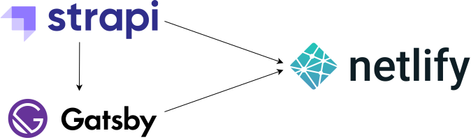

    

# [**Labba Labba** page](https://www.labbalabba.page/) 🎙

This is a source code of blog webpage <https://www.labbalabba.page>.

> Labba Labba is a platform featuring people from the dancehall world.

# Architecture

Three main components are used:

  

## [Gatsby JS](https://www.gatsbyjs.com/)

Free, open source framework for building websites and applications.

- Front-end is written with help of Gatsby.
- The result is a [static website](https://www.gatsbyjs.com/docs/glossary/static-site-generator/).
- Customized version of great [Gatsby theme Novela](https://github.com/narative/gatsby-theme-novela) was used as template.
- Webpages are created programatically using `GraphQL` queries to **Strapi**.

## [Strapi](https://strapi.io/)

Strapi is open-source headless CMS. It’s 100% Javascript, fully customizable and developer-first.

- All data (articles, authors, site metadata, images) are stored in my **Strapi** docker container.
- Data access is done with GraphQL and Rest API.
- New content can be easilly added by `non-programmer`.
  
## [Netlify](https://www.netlify.com/)

Netlify let's you build, host, and maintain your static website.

- Netlify is taking care of web hosting of <https://www.labbalabba.page>.
- Web is redeployed automatically whenever there is new push to the Github Master branch or when a new content has been published in Strapi.
- I've made custom [Netlify Gmail Plugin](https://github.com/racoonx2p/netlify-plugin-gmail) to notify on every succesfull or failed build.
